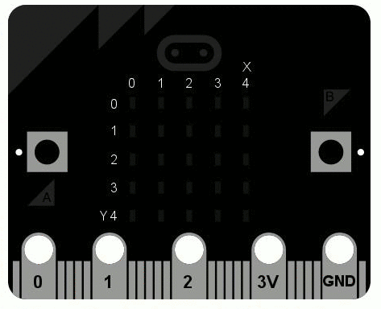

Display
*******

.. py:module:: microbit.display

This module controls the 5×5 LED display on the front of your board. It can
be used to display images, animations and even text.

Functions
=========

.. py:function:: get_pixel(x, y)

    Return the brightness of the LED at column ``x`` and row ``y`` as an
    integer between 0 (off) and 9 (bright).

.. py:function:: set_pixel(x, y, value)

    Set the brightness of the LED at column ``x`` and row ``y`` to ``value``,
    which has to be an integer between 0 and 9.

.. py:function:: clear()

    Set the brightness of all LEDs to 0 (off).

.. py:function:: show(image)

    Display the ``image``.

.. py:function:: show(iterable, delay=400, \*, wait=True, loop=False, clear=False)

    Display images or letters from the ``iterable`` in sequence, with ``delay``
    milliseconds between them.

    If ``wait`` is ``True``, this function will block until the animation is
    finished, otherwise the animation will happen in the background.

    If ``loop`` is ``True``, the animation will repeat forever.

    If ``clear`` is ``True``, the display will be cleared after the iterable has finished.

    Note that the ``wait``, ``loop`` and ``clear`` arguments must be specified
    using their keyword.

.. note::

    If using a generator as the ``iterable``, then take care not to allocate any memory
    in the generator as allocating memory in an interrupt is prohibited and will raise a
    ``MemoryError``.

.. py:function:: scroll(string, delay=150, \*, wait=True, loop=False, monospace=False)

    Similar to ``show``, but scrolls the ``string`` horizontally instead. The
    ``delay`` parameter controls how fast the text is scrolling.

    If ``wait`` is ``True``, this function will block until the animation is
    finished, otherwise the animation will happen in the background.

    If ``loop`` is ``True``, the animation will repeat forever.

    If ``monospace`` is ``True``, the characters will all take up 5 pixel-columns
    in width, otherwise there will be exactly 1 blank pixel-column between each
    character as they scroll.

    Note that the ``wait``, ``loop`` and ``monospace`` arguments must be specified
    using their keyword.

.. py:function:: on()

    Use on() to turn on the display.

.. py:function:: off()

    Use off() to turn off the display (thus allowing you to re-use the GPIO
    pins associated with the display for other purposes).

.. py:function:: is_on()

    Returns ``True`` if the display is on, otherwise returns ``False``.

Example
=======

To continuously scroll a string across the display, and do it in the background,
you can use::

    import microbit

    microbit.display.scroll('Hello!', wait=False, loop=True)
