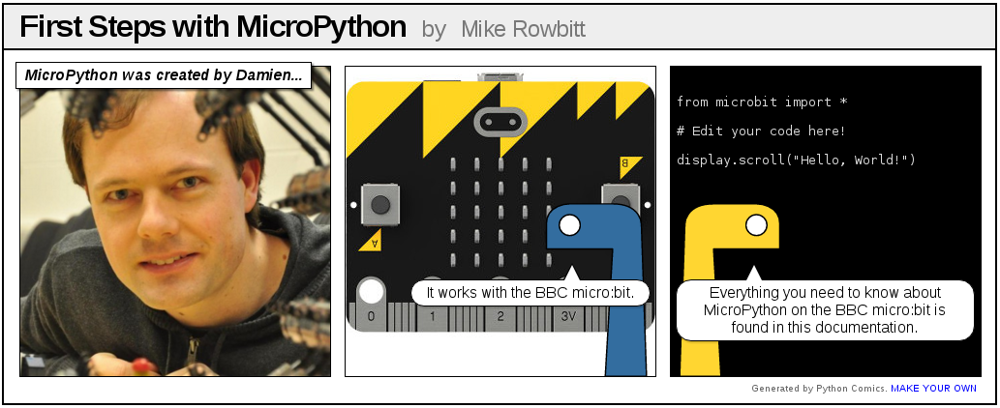

.. BBC Microbit Micropython documentation master file, created by
   sphinx-quickstart on Tue Oct 20 10:41:30 2015.
   You can adapt this file completely to your liking, but it should at least
   contain the root `toctree` directive.

BBC micro:bit MicroPython documentation
=======================================

Welcome!

The BBC micro:bit is a small computing device for children. One of the
languages it understands is the popular Python programming language. The
version of Python that runs on the BBC micro:bit is called MicroPython.

This documentation includes lessons for teachers
and API documentation for developers (check out the index on the left). We hope
you enjoy developing for the BBC micro:bit using MicroPython.

If you're a new programmer, teacher or unsure where to start, begin with the tutorials.

To get involved with the community subscribe to the microbit@python.org
mailing list (https://mail.python.org/mailman/listinfo/microbit).

.. note::

    This project is under active development. Please help other
    developers by adding tips, how-tos, and Q&A to this document.
    Thanks!

Projects related to MicroPython on the BBC micro:bit include:

* `Mu <https://github.com/ntoll/mu>`_ - a simple code editor for kids, teachers and beginner programmers. Probably the easiest way for people to program MicroPython on the BBC micro:bit.
* `uFlash <https://uflash.readthedocs.io/en/latest/>`_ - a command line tool for flashing raw Python scripts onto a BBC micro:bit.

.. toctree::
    :maxdepth: 2
    :caption: Tutorials

    tutorials/introduction
    tutorials/hello
    tutorials/images
    tutorials/buttons
    tutorials/io
    tutorials/music
    tutorials/random
    tutorials/movement
    tutorials/gestures
    tutorials/direction
    tutorials/storage
    tutorials/speech
    tutorials/network
    tutorials/radio
    tutorials/next

.. toctree::
   :maxdepth: 2
   :caption: API Reference

   microbit_micropython_api.rst
   microbit.rst
   accelerometer.rst
   ble.rst
   button.rst
   compass.rst
   display.rst
   filesystem.rst
   i2c.rst
   image.rst
   music.rst
   neopixel.rst
   os.rst
   pin.rst
   radio.rst
   random.rst
   speech.rst
   spi.rst
   uart.rst

.. toctree::
   :maxdepth: 2
   :caption: Developer Guide

   devguide/installation
   devguide/flashfirmware
   devguide/repl
   devguide/devfaq
   devguide/contributing

.. toctree::
   :maxdepth: 2
   :caption: Indices and tables

* :ref:`genindex`
* :ref:`modindex`
* :ref:`search`
