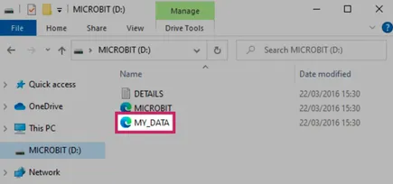
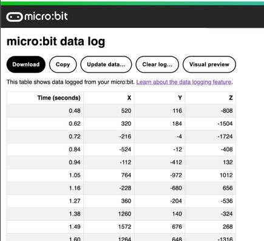

Data Logging **V2**
*******************

.. py:module:: log

This module lets you log data to a ``MY_DATA`` file saved on a micro:bit
**V2** ``MICROBIT`` USB drive.

The data is structured in a table format and it can be viewed and plotted with
a browser.

Further guidance on this feature can be found on the
`data logging page of the microbit.org website
<https://microbit.org/get-started/user-guide/data-logging/>`_.

Functions
=========

.. py:function:: set_labels(*labels, timestamp=log.SECONDS)

    Set up the log file header.

    This function accepts any number of positional arguments, each creates
    a column header, e.g. ``log.set_labels("X", "Y", "Z")``.

    Ideally this function should be called a single time, before any data is
    logged, to configure the data table header once.

    If a log file already exists when the programme starts, or if this function
    is called multiple times, it will check the labels already defined in the
    log file.
    If this function call contains any new labels not already present, it will
    generate a new header row with the additional columns.

    By default the first column contains a time stamp for each row. The time
    unit can be selected via the ``timestamp`` argument, e.g.
    ``log.set_labels("temp", timestamp=log.MINUTES)``

    :param \*labels: Any number of positional arguments, each corresponding to
        an entry in the log header.
    :param timestamp: Select the timestamp unit that will be automatically
        added as the first column in every row. Timestamp values can be one of
        ``log.MILLISECONDS``, ``log.SECONDS``, ``log.MINUTES``, ``log.HOURS``,
        ``log.DAYS`` or ``None`` to disable the timestamp. The default value
        is ``log.SECONDS``.

.. py:function:: set_mirroring(serial)

    Configure mirroring of the data logging activity to the serial output.

    Serial mirroring is disabled by default. When enabled, it will print to
    serial each row logged into the log file.

    :param serial: ``True`` enables mirroring data to the serial output.

.. py:function:: delete(full=False)

    Delete the contents of the log, including headers.

    To add the log headers again the ``set_labels`` function should to be
    called after this function.

    There are two erase modes; "full" completely removes the data from the
    physical storage, and "fast" invalidates the data without removing it.

    :param full: ``True`` selects a "full" erase and ``False`` selects the
        "fast" erase method.

.. py:function:: add( data_dictionary, /, *, **kwargs)

    Add a data row to the log.

    There are two ways to log data with this function:

    #. Via keyword arguments, each argument name representing a label.

       * e.g. ``log.add(X=compass.get_x(), Y=compass.get_y())``

    #. Via a dictionary, each dictionary key representing a label.

       * e.g. ``log.add({ "X": compass.get_x(), "Y": compass.get_y() })``

    The keyword argument option can be easier to use, and the dictionary option
    allows the use of spaces (and other special characters), that could not be
    used with the keyword arguments.

    New labels not previously specified via the ``set_labels`` function, or by
    a previous call to this function, will trigger a new header entry to be
    added to the log with the extra labels.

    Labels previously specified and not present in a call to this function will
    be skipped with an empty value in the log row.

    :raise OSError: When the log is full this function raises an ``OSError``
        exception with error code 28 ``ENOSPC``, which indicates there is no
        space left in the device.

Examples
========

A minimal example::

    from microbit import *
    import log

    # Set the timer to log data every 5 seconds
    @run_every(s=5)
    def log_temp():
        log.add(temp=temperature())

    while True:
        # Needed so that the programme doesn't end
        sleep(100)

An example that runs through all of the functions of the log module API:

.. include:: ../examples/data-logging.py
    :code: python
