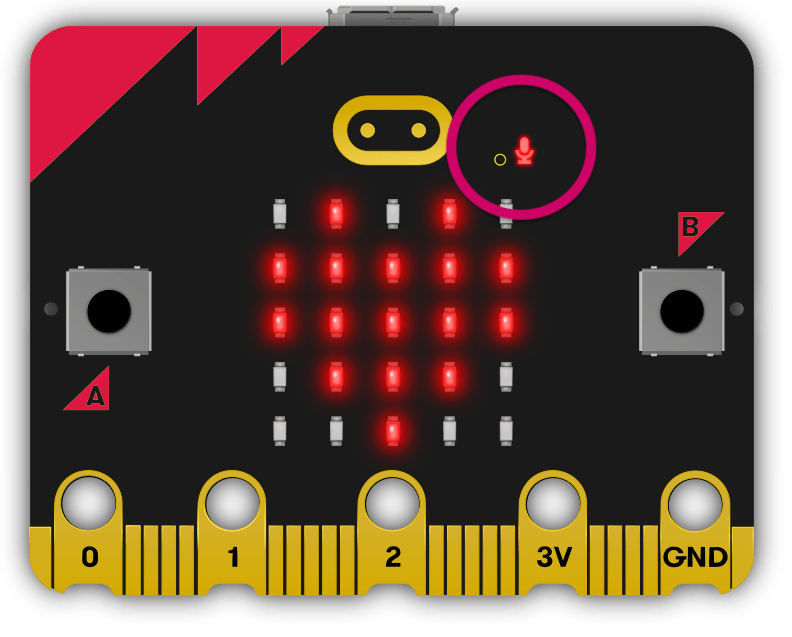

Microphone **V2**
*****************

.. py::module:: microbit

This object lets you access the on-board microphone available on the **V2**
micro:bit version. It can be used to respond to sound. The microphone input
is located on the front of the board alongside a microphone activity LED,
which is lit when the microphone is in use.

Sound events
============
The microphone can respond to a pre-defined set of sound events that are
based on the amplitude and wavelength of the sound.

These sound events are identified by strings passed as method arguments and
return values. These strings are also stored as `MicrobitMicrophone` class
variables as a handy way to identify what events are available.

Classes
=======
.. py:class:: MicrobitMicrophone

    .. note::
        The `MicrobitMicroPhone` class documented here can be accessed via the microbit module as
        `microbit.microphone`. It cannot be initialised on it's own.

    Represents the microphone

    #: Value to represent loud sound events, like clapping or shouting
    LOUD = "loud"
    #: Value to represent quiet sound events, like speaking or background music
    QUIET = "quiet"

    def current_sound(self) -> string:
        """
        :return: The name of the last recorded sound event, `loud` or `quiet`.
        """
        pass

    def was_sound(self, sound: string) -> bool:
        """
        :param sound: A sound event,  such as `microphone.LOUD` or
            `microphone.QUIET`.
        :return: `true` if sound was heard at least once since the last
        call, otherwise `false`.
        """
        pass

    def get_sounds(self):
        """
        :return: A tuple of the event history. The most recent is listed last.
        Also clears the sound event history before returning
        """
        pass

    def set_threshold(self, sound: string, level: int) -> None:
        """
        :param sound: A sound event, such as `microphone.LOUD` or
        `microphone.QUIET`.
        :param value: The threshold level in the range 0-255. For example,
            `set_threshold(microphone.LOUD, 250)` will only trigger if the
            sound is very loud (>= 250).
        """
        pass

    def sound_level(self) -> int:
        """
        :return: A representation of the sound pressure level in the range 0 to
        20000.
        """
        pass

Example
=======

An example that runs through all the functions of the microphone API

.. code::

    # Basic test for microphone.  This test should update the display when Button A is pressed and a loud or quiet sound *is* heard,
    # printing the results. On Button B This test should update the display when a loud or quiet sound *was* heard,
    # printing the results. On shake this should print the last sounds heard, you shoul try this test whilst
    # making a loud sound and a quiet one before you shake.

    from microbit import *

    icons = {
        microphone.LOUD: Image.SQUARE,
        microphone.QUIET: Image.SQUARE_SMALL
    }

    display.clear()
    sound = microphone.current_sound()

    while True:
        if button_a.is_pressed():
            if microphone.current_sound() == microphone.LOUD:
                display.show(Image.SQUARE)
                uart.write('isLoud\n')
            elif microphone.current_sound() == microphone.QUIET:
                display.show(Image.SQUARE_SMALL)
                uart.write('isQuiet\n')
            sleep(500)
        display.clear()
        if button_b.is_pressed():
            if microphone.was_sound(microphone.LOUD):
                display.show(Image.SQUARE)
                uart.write('wasLoud\n')
            elif microphone.was_sound(microphone.QUIET):
                display.show(Image.SQUARE_SMALL)
                uart.write('wasQuiet\n')
            else:
                display.clear()
            sleep(500)
        display.clear()
        if accelerometer.was_gesture('shake'):
            sounds = microphone.get_sounds()
            soundLevel = microphone.sound_level()
            print(soundLevel)
            for sound in sounds:
                display.show(icons[sound])
                print(sound)
                sleep(500)
