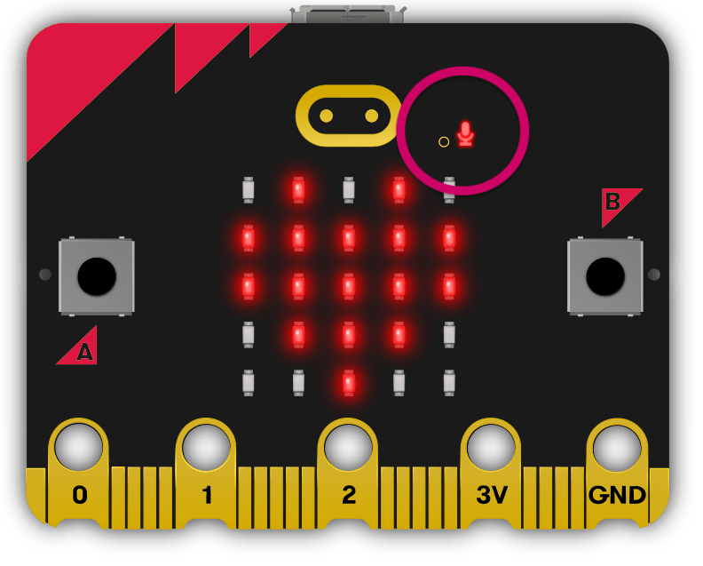

Microphone **V2**
*****************

.. py:module:: microbit.microphone

This object lets you access the built-in microphone available on the
micro:bit **V2**. It can be used to respond to sound. The microphone input
is located on the front of the board alongside a microphone activity LED,
which is lit when the microphone is in use.

Sound events
============
The microphone can respond to a pre-defined set of sound events that are
based on the amplitude and wavelength of the sound.

These sound events are represented by instances of the ``SoundEvent`` class,
accessible via variables in ``microbit.SoundEvent``:

- ``microbit.SoundEvent.QUIET``: Represents the transition of sound events,
  from ``loud`` to ``quiet`` like speaking or background music.

- ``microbit.SoundEvent.LOUD``: Represents the transition of sound events,
  from ``quiet`` to ``loud`` like shouting.

- ``microbit.SoundEvent.CLAP``: Detects a loud event similar to a clap.

Functions
=========

.. py:function:: current_event()

    :returns: The name of the last recorded sound event,
      ``SoundEvent('loud')``, ``SoundEvent('quiet')``, ``SoundEvent('clap')``.

.. py:function:: was_event(event)

    :param event: A sound event,  such as ``SoundEvent.LOUD``,
      ``SoundEvent.QUIET``, or ``SoundEvent.CLAP``.
    :returns: ``true`` if sound was heard at least once since the last
      call, otherwise ``false``. ``was_event()`` also clears the sound
      event history before returning.

.. py:function:: is_event(event)

    :param event: A sound event,  such as ``SoundEvent.LOUD`` or
      ``SoundEvent.QUIET``, or ``SoundEvent.CLAP``.
    :returns: ``true`` if sound event is the most recent since the last
      call, otherwise ``false``. It does not clear the sound event history.

.. py:function:: get_events()

    :returns: A tuple of the event history. The most recent is listed last.
      ``get_events()`` also clears the sound event history before returning.

.. py:function:: set_threshold(event, value)

    :param event: A ``SoundEvent.LOUD`` or ``SoundEvent.QUIET`` sound event.
    :param value: The threshold level in the range 0-255. For example,
      ``set_threshold(SoundEvent.LOUD, 250)`` will only trigger if the sound is
      very loud (>= 250).

.. py:function:: sound_level()

    :returns: A representation of the sound pressure level in the range 0 to
      255.

Example
=======

An example that runs through some of the functions of the microphone API::

    # Basic test for microphone.  This test should update the display when
    # Button A is pressed and a loud or quiet sound *is* heard, printing the
    # results. On Button B this test should update the display when a loud or
    # quiet sound *was* heard, printing the results. On shake this should print
    # the last sounds heard, you should try this test whilst making a loud sound
    # and a quiet one before you shake.

    from microbit import *

    display.clear()
    sound = microphone.current_event()

    while True:
        if button_a.is_pressed():
            if microphone.current_event() == SoundEvent.CLAP:
                display.show(Image.DIAMOND)
                uart.write('isClap\n')
            elif microphone.current_event() == SoundEvent.LOUD:
                display.show(Image.SQUARE)
                uart.write('isLoud\n')
            elif microphone.current_event() == SoundEvent.QUIET:
                display.show(Image.SQUARE_SMALL)
                uart.write('isQuiet\n')
            sleep(500)
        display.clear()
        if button_b.is_pressed():
            if microphone.was_event(SoundEvent.CLAP):
                display.show(Image.DIAMOND)
                uart.write('wasClap\n')
            elif microphone.was_event(SoundEvent.LOUD):
                display.show(Image.SQUARE)
                uart.write('wasLoud\n')
            elif microphone.was_event(SoundEvent.QUIET):
                display.show(Image.SQUARE_SMALL)
                uart.write('wasQuiet\n')
            else:
                display.clear()
            sleep(500)
        display.clear()
        if accelerometer.was_gesture('shake'):
            sounds = microphone.get_events()
            soundLevel = microphone.sound_level()
            print(soundLevel)
            for sound in sounds:
                if sound == SoundEvent.CLAP:
                    display.show(Image.DIAMOND)
                elif sound == SoundEvent.LOUD:
                    display.show(Image.SQUARE)
                elif sound == SoundEvent.QUIET:
                    display.show(Image.SQUARE_SMALL)
                else:
                    display.clear()
                print(sound)
                sleep(500)
