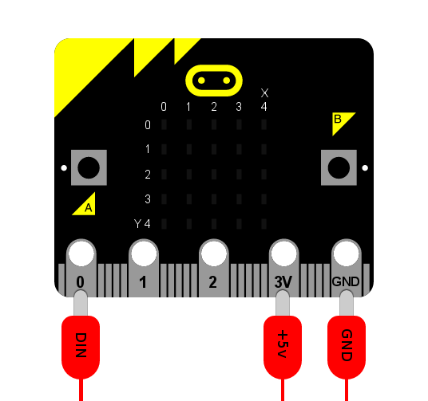

NeoPixel
********

.. py:module:: neopixel

The ``neopixel`` module lets you use Neopixel (WS2812) individually addressable
RGB LED strips with the Microbit. Note to use the ``neopixel`` module, you
need to import it separately with::

    import neopixel

.. note::

    From our tests, the Microbit Neopixel module can drive up to around 256
    Neopixels. Anything above that and you may experience weird bugs and
    issues.

NeoPixels are fun strips of multi-coloured programmable LEDs. This module
contains everything to plug them into a micro:bit and create funky displays,
art and games such as the demo shown below.

.. image:: neopixel.gif

To connect a strip of neopixels you'll need to attach the micro:bit as shown
below (assuming you want to drive the pixels from pin 0 - you can connect
neopixels to pins 1 and 2 too). The label on the crocodile clip tells you where
to attach the other end on the neopixel strip.

.. warning::

    Do not use the 3v connector on the Microbit to power any more than 8
    Neopixels at a time.

    If you wish to use more than 8 Neopixels, you must use a separate 3v-5v
    power supply for the Neopixel power pin.

Classes
=======

.. py:class::
    NeoPixel(pin, n)

    Initialise a new strip of ``n`` number of neopixel LEDs controlled via pin
    ``pin``. Each pixel is addressed by a position (starting from 0). Neopixels
    are given RGB (red, green, blue) values between 0-255 as a tuple. For
    example, ``(255,255,255)`` is white.

    .. py:method:: clear()

        Clear all the pixels.

    .. py:method:: show()

        Show the pixels. Must be called for any updates to become visible.

Operations
==========

Writing the colour doesn't update the display (use ``show()`` for that).

.. code::

    np[0] = (255, 0, 128)  # first element
    np[-1] = (0, 255, 0)  # last element
    np.show()  # only now will the updated value be shown

To read the colour of a specific pixel just reference it.

.. code::

    print(np[0])

Using Neopixels
===============

Interact with Neopixels as if they were a list of tuples. Each tuple represents
the RGB (red, green and blue) mix of colours for a specific pixel. The RGB
values can range between 0 to 255.

For example, initialise a strip of 8 neopixels on a strip connected to pin0
like this::

    import neopixel
    np = neopixel.NeoPixel(pin0, 8)

Set pixels by indexing them (like with a Python list). For instance, to
set the first pixel to full brightness red, you would use::

    np[0] = (255, 0, 0)

Or the final pixel to purple::

    np[-1] = (255, 0, 255)

Get the current colour value of a pixel by indexing it. For example, to print
the first pixel's RGB value use::

    print(np[0])

Finally, to push the new colour data to your Neopixel strip, use the .show()
function::

    np.show()

If nothing is happening, it's probably because you've forgotten this final
step..!

.. note::

    If you're not seeing anything change on your Neopixel strip, make sure
    you have ``show()`` at least somewhere otherwise your updates won't be
    shown.

Example
=======

.. include:: ../examples/neopixel_random.py
    :code: python
