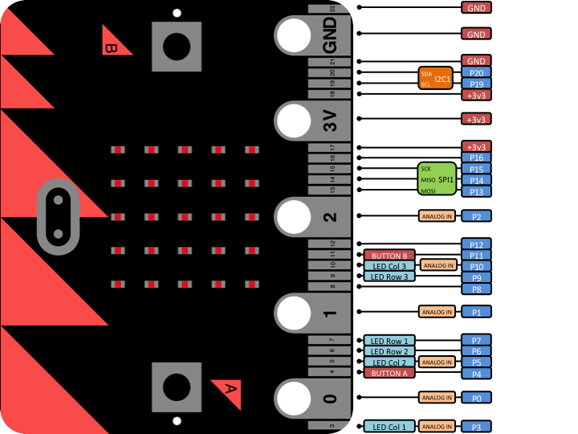

Input/Output Pins
*****************

.. py:module:: microbit

The pins are your board's way to communicate with external devices connected to
it. There are 19 pins for your disposal, numbered 0-16 and 19-20. Pins 17 and
18 are not available.

For example, the script below will change the display on the micro:bit
depending upon the digital reading on pin 0::

    from microbit import *

    while True:
        if pin0.read_digital():
            display.show(Image.HAPPY)
        else:
            display.show(Image.SAD)

Pin Functions
=============

Those pins are available as attributes on the ``microbit``
module:``microbit.pin0`` - ``microbit.pin20``.

+-----+---------+----------+
| Pin | Type    | Function |
+=====+=========+==========+
|  0  | Touch   | Pad 0    |
+-----+---------+----------+
|  1  | Touch   | Pad 1    |
+-----+---------+----------+
|  2  | Touch   | Pad 2    |
+-----+---------+----------+
|  3  | Analog  | Column 1 |
+-----+---------+----------+
|  4  | Analog  | Column 2 |
+-----+---------+----------+
|  5  | Digital | Button A |
+-----+---------+----------+
|  6  | Digital | Row 2    |
+-----+---------+----------+
|  7  | Digital | Row 1    |
+-----+---------+----------+
|  8  | Digital |          |
+-----+---------+----------+
|  9  | Digital | Row 3    |
+-----+---------+----------+
|  10 | Analog  | Column 3 |
+-----+---------+----------+
|  11 | Digital | Button B |
+-----+---------+----------+
|  12 | Digital |          |
+-----+---------+----------+
|  13 | Digital | SPI MOSI |
+-----+---------+----------+
|  14 | Digital | SPI MISO |
+-----+---------+----------+
|  15 | Digital | SPI SCK  |
+-----+---------+----------+
|  16 | Digital |          |
+-----+---------+----------+
+-----+---------+----------+
|  19 | Digital | I2C SCL  |
+-----+---------+----------+
|  20 | Digital | I2C SDA  |
+-----+---------+----------+

The above table summarizes the pins available, their types (see below) and what
they are internally connected to.

Pulse-Width Modulation
----------------------

The pins of your board cannot output analog signal the way an audio amplifier
can do it -- by modulating the voltage on the pin. Those pins can only either
enable the full 3.3V output, or pull it down to 0V. However, it is still
possible to control the brightness of LEDs or speed of an electric motor, by
switching that voltage on and off very fast, and controlling how long it is on
and how long it is off. This technique is called Pulse-Width Modulation (PWM),
and that's what the ``write_analog`` method below does.

.. image:: pwm.png

Above you can see the diagrams of three different PWM signals. All of them have
the same period (and thus frequency), but they have different duty cycles.

The first one would be generated by ``write_analog(511)``, as it has exactly
50% duty -- the power is on half of the time, and off half of the time. The
result of that is that the total energy of this signal is the same, as if it
was 1.65V instead of 3.3V.

The second signal has 25% duty cycle, and could be generated with
``write_analog(255)``. It has similar effect as if 0.825V was being output on
that pin.

The third signal has 75% duty cycle, and can be generated with
``write_analog(767)``. It has three times as much energy, as the second signal,
and is equivalent to outputting 2.475V on th pin.

Note that this works well with devices such as motors, which have huge inertia
by themselves, or LEDs, which blink too fast for the human eye to see the
difference, but will not work so good with generating sound waves. This board
can only generate square wave sounds on itself, which sound pretty much like
the very old computer games -- mostly because those games also only could do
that.

Classes
=======

There are three kinds of pins, differing in what is available for them. They
are represented by the classes listed below. Note that they form a hierarchy,
so that each class has all the functionality of the previous class, and adds
its own to that.

.. note::
    Those classes are not actually available for the user, you can't create
    new instances of them. You can only use the instances already provided,
    representing the physical pins on your board.

.. py:class:: MicroBitDigitalPin

    .. py:method:: read_digital()

        Return 1 if the pin is high, and 0 if it's low.

    .. py:method:: write_digital(value)

        Set the pin to high if ``value`` is 1, or to low, if it is 0.

    .. py:method::set_pull(value)

        Set the pull state to one of three possible values: ``pin.PULL_UP``,
        ``pin.PULL_DOWN`` or ``pin.NO_PULL`` (where ``pin`` is an instance of
        a pin). See below for discussion of default pull states.

.. py:class:: MicroBitAnalogDigitalPin

    .. py:method:: read_analog()

        Read the voltage applied to the pin, and return it as an integer
        between 0 (meaning 0V) and 1023 (meaning 3.3V).

    .. py:method:: write_analog(value)

        Output a PWM signal on the pin, with the duty cycle proportional to
        the provided ``value``. The ``value`` may be either an integer or a
        floating point number between 0 (0% duty cycle) and 1023 (100% duty).

    .. py:method:: set_analog_period(period)

        Set the period of the PWM signal being output to ``period`` in
        milliseconds. The minimum valid value is 1ms.

    .. py:method:: set_analog_period_microseconds(period)

        Set the period of the PWM signal being output to ``period`` in
        microseconds. The minimum valid value is 256µs.

.. py:class:: MicroBitTouchPin

    .. py:method:: is_touched()

        Return ``True`` if the pin is being touched with a finger, otherwise
        return ``False``.

        This test is done by measuring how much resistance there is between the
        pin and ground.  A low resistance gives a reading of ``True``.  To get
        a reliable reading using a finger you may need to touch the ground pin
        with another part of your body, for example your other hand.

The pull mode for a pin is automatically configured when the pin changes to an
input mode. Input modes are when you call ``read_analog`` / ``read_digital`` /
``is_touched``. The default pull mode for these is, respectively, ``NO_PULL``,
``PULL_DOWN``, ``PULL_UP``. Calling ``set_pull`` will configure the pin to be
in ``read_digital`` mode with the given pull mode.

.. note::
    Also note, the micro:bit has external weak (10M) pull-ups fitted on pins
    0, 1 and 2 only, in order for the touch sensing to work. See the edge
    connector data sheet here:
    http://tech.microbit.org/hardware/edgeconnector_ds/
