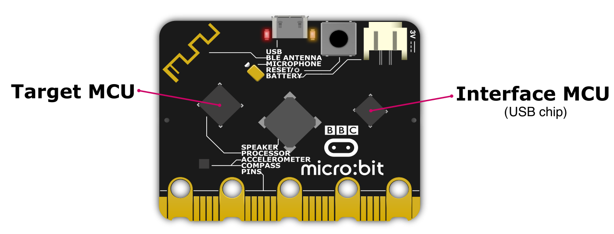

Power Management **V2**
***********************

.. py:module:: power

This module lets you manage the power modes of the micro:bit V2.

There are two micro:bit board low power modes that can be requested from
MicroPython:

- **Deep Sleep**: Low power mode where the board can be woken up via
  multiple sources (pins, button presses, uart data, or a timer) and resume
  operation.
- **Off**: The power mode with the lowest power consumption, the only way to
  wake up the board is via the reset button, or by plugging the USB cable while
  on battery power.
  When the board wakes up it will restart and execute your programme from the
  beginning.

More information on how these low power modes work can be found in the
`Detailed Information section <#detailed-information>`_.

Functions
=========

.. py:function:: off()

    Power down the board to the lowest possible power mode.

    This is the equivalent to pressing the reset button for a few second,
    to set the board in "Off mode".

    The micro:bit will only wake up if the reset button is pressed or,
    if on battery power, when a USB cable is connected.

    When the board wakes up it will start for a reset state, so your programme
    will start running from the beginning.

.. py:function:: deep_sleep(ms=None, wake_on=None, run_every=True)

    Set the micro:bit into a low power mode where it can wake up and continue
    operation.

    The programme state is preserved and when it wakes up it will resume
    operation where it left off.

    Deep Sleep mode will consume more battery power than Off mode.

    The wake up sources are configured via arguments.

    The board will always wake up when receiving UART data, when the reset
    button is pressed (which resets the board) or, in battery power,
    when the USB cable is inserted.

    When the ``run_every`` parameter is set to ``True`` (the default), any
    function scheduled with :py:meth:`microbit.run_every<microbit.run_every>`
    will momentarily wake up the board to run and when it finishes it will go
    back to sleep.

    :param ms: A time in milliseconds to wait before it wakes up.
    :param wake_on: A single instance or a tuple of pins and/or buttons to
        wake up the board, e.g. ``deep_sleep(wake_on=button_a)`` or
        ``deep_sleep(wake_on=(pin0, pin2, button_b))``.
    :param run_every: A boolean to configure if the functions scheduled with
        ``microbit.run_every`` will continue to run while it sleeps.

Examples
========

Example programme showing the power management API:

.. include:: ../examples/low-power.py
    :code: python

Example using data logging:

.. include:: ../examples/datalog-sleep.py
    :code: python

Detailed Information
====================

The micro:bit board has two microcontrollers (MCUs), which can be
independently asleep or awake:

- **Target MCU** - Where MicroPython and your code run.
- **Interface MCU** - A secondary microcontroller that provides the USB
  functionality, like the ``MICROBIT`` USB drive, and the USB serial interface.

Each MCU can be in one of these "MCU power modes":

- **Awake**: Running normally.
- **Sleep**: A low power mode where the MCU can be woken up from different
  sources and continue operation.
- **Power Down**: The lowest power mode for an individual MCU, when it wakes up
  it will start from reset.

The Python code can request a "board power mode", in this case **Deep Sleep**
or **Off**, which will set the Target into a specific "MCU power mode",
but the Interface MCU mode will depend on the micro:bit power source,
i.e. if it's powered via USB (connector to a computer) or battery.

In essence, on battery power the Interface MCU can go into a low power mode,
but when it is connected to a computer via USB, it will stay awake to maintain
the USB connection.

+------------------+-----------------+--------------------+
| .. centered:: USB Powered (Interface always awake)      |
+------------------+-----------------+--------------------+
| Board Power Mode | Target MCU Mode | Interface MCU mode |
+==================+=================+====================+
| **Deep Sleep**   | 💤  Sleep       | ⏰ Awake           |
+------------------+-----------------+--------------------+
| **Off**          | 📴 Power Down   | ⏰ Awake           |
|                  |                 | (red LED blinking) |
+------------------+-----------------+--------------------+

+------------------+-----------------+--------------------+
| .. centered:: Battery Powered                           |
+------------------+-----------------+--------------------+
| Board Power Mode | Target MCU Mode | Interface MCU mode |
+==================+=================+====================+
| **Deep Sleep**   | 💤 Sleep        | 💤 Sleep           |
+------------------+-----------------+--------------------+
| **Off**          | 📴 Power Down   | 📴 Power Down      |
+------------------+-----------------+--------------------+

Deep Sleep & run_every
----------------------

To make sure the :py:meth:`microbit.run_every<microbit.run_every>`
functions continue to run during "Deep Sleep", the micro:bit will wake up
at the correct time to run the next scheduled ``run_every``,
and then go back to "Deep Sleep" mode as soon as that ``run_every`` completes.
It will continue to do this until the deep sleep finishes due
to the ``ms`` timeout being reached, or a ``wake_on`` event occurs.
