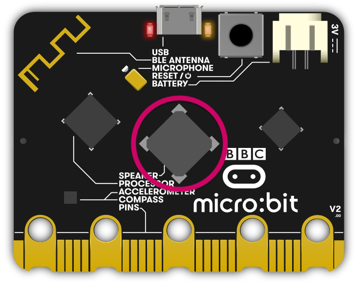

Speaker **V2**
**************

.. py:module:: microbit.speaker

The micro:bit **V2** has a built-in speaker located on the rear of the board.

By default sound output will be via the edge connector on pin 0 and the
built-in speaker **V2**. You can connect wired headphones or a speaker to
pin 0 and GND on the edge connector to hear the sounds.

The speaker can be turned off or on using the functions listed here.

Functions
=========

.. py:function:: off()

    Use ``off()`` to turn off the speaker. This does not disable sound output
    to an edge connector pin.

.. py:function:: on()

    Use ``on()`` to turn on the speaker.

Example
=======

An example that runs through some of the functions of the speaker API. ::

    from microbit import *

    # Check that the speaker is on
    print(speaker.is_on())
    # Play a sound
    audio.play(Sound.HELLO)
    sleep(2000)
    # Disable the speaker
    speaker.off()
    # Check that the speaker is off
    print(speaker.is_on())
    # Play a sound. This will not be heard on the speaker, but will be heard
    # on Pin 0 if you have headphones or a speaker connected.
    audio.play(Sound.HELLO)
