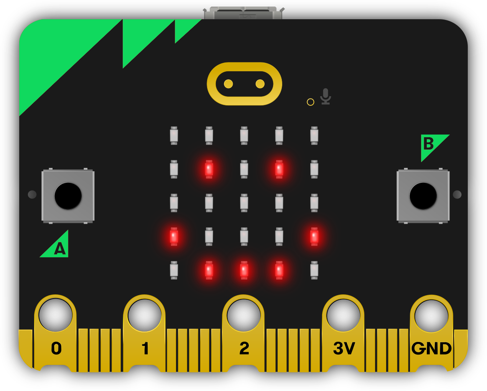

Images
------

MicroPython is about as good at art as you can be if the only thing you have is
a 5x5 grid of red LEDs (light emitting diodes - the things that light up on the
front of the device). MicroPython gives you quite a lot of control over the
display so you can create all sorts of interesting effects.

MicroPython comes with lots of built-in pictures to show on the display.
For example, to make the device appear happy you type::

    from microbit import *
    display.show(Image.HAPPY)

I suspect you can remember what the first line does. The second line uses the
``display`` object to ``show`` a built-in image. The happy image we want to
display is a part of the ``Image`` object and called ``HAPPY``. We tell
``show`` to use it by putting it between the parenthesis (``(`` and ``)``).

Here's a list of the built-in images:

    * ``Image.HEART``
    * ``Image.HEART_SMALL``
    * ``Image.HAPPY``
    * ``Image.SMILE``
    * ``Image.SAD``
    * ``Image.CONFUSED``
    * ``Image.ANGRY``
    * ``Image.ASLEEP``
    * ``Image.SURPRISED``
    * ``Image.SILLY``
    * ``Image.FABULOUS``
    * ``Image.MEH``
    * ``Image.YES``
    * ``Image.NO``
    * ``Image.CLOCK12``, ``Image.CLOCK11``, ``Image.CLOCK10``, ``Image.CLOCK9``,
      ``Image.CLOCK8``, ``Image.CLOCK7``, ``Image.CLOCK6``, ``Image.CLOCK5``,
      ``Image.CLOCK4``, ``Image.CLOCK3``, ``Image.CLOCK2``, ``Image.CLOCK1``
    * ``Image.ARROW_N``, ``Image.ARROW_NE``, ``Image.ARROW_E``,
      ``Image.ARROW_SE``, ``Image.ARROW_S``, ``Image.ARROW_SW``,
      ``Image.ARROW_W``, ``Image.ARROW_NW``
    * ``Image.TRIANGLE``
    * ``Image.TRIANGLE_LEFT``
    * ``Image.CHESSBOARD``
    * ``Image.DIAMOND``
    * ``Image.DIAMOND_SMALL``
    * ``Image.SQUARE``
    * ``Image.SQUARE_SMALL``
    * ``Image.RABBIT``
    * ``Image.COW``
    * ``Image.MUSIC_CROTCHET``
    * ``Image.MUSIC_QUAVER``
    * ``Image.MUSIC_QUAVERS``
    * ``Image.PITCHFORK``
    * ``Image.XMAS``
    * ``Image.PACMAN``
    * ``Image.TARGET``
    * ``Image.TSHIRT``
    * ``Image.ROLLERSKATE``
    * ``Image.DUCK``
    * ``Image.HOUSE``
    * ``Image.TORTOISE``
    * ``Image.BUTTERFLY``
    * ``Image.STICKFIGURE``
    * ``Image.GHOST``
    * ``Image.SWORD``
    * ``Image.GIRAFFE``
    * ``Image.SKULL``
    * ``Image.UMBRELLA``
    * ``Image.SNAKE``

There's quite a lot! Why not modify the code that makes the micro:bit look
happy to see what some of the other built-in images look like? (Just replace
``Image.HAPPY`` with one of the built-in images listed above.)

DIY Images
++++++++++

Of course, you want to make your own image to display on the micro:bit, right?

That's easy.

Each LED pixel on the physical display can be set to one of ten values. If a
pixel is set to ``0`` (zero) then it's off. It literally has zero brightness.
However, if it is set to ``9`` then it is at its brightest level. The values
``1`` to ``8`` represent the brightness levels between off (``0``) and full on
(``9``).

Armed with this information, it's possible to create a new image like this::

    from microbit import *

    boat = Image("05050:"
                 "05050:"
                 "05050:"
                 "99999:"
                 "09990")

    display.show(boat)

(When run, the device should display an old-fashioned "Blue Peter" sailing ship
with the masts dimmer than the boat's hull.)

Have you figured out how to draw a picture? Have you noticed that each line of
the physical display is represented by a line of numbers ending in ``:`` and
enclosed between ``"`` double quotes? Each number specifies a brightness.
There are five lines of five numbers so it's possible to specify the individual
brightness for each of the five pixels on each of the five lines on the
physical display. That's how to create a new image.

Simple!

In fact, you don't need to write this over several lines. If you think you can
keep track of each line, you can rewrite it like this::

    boat = Image("05050:05050:05050:99999:09990")

Animation
+++++++++

Static images are fun, but it's even more fun to make them move. This is also
amazingly simple to do with MicroPython ~ just use a list of images!

Here is a shopping list::

    Eggs
    Bacon
    Tomatoes

Here's how you'd represent this list in Python::

    shopping = ["Eggs", "Bacon", "Tomatoes" ]

I've simply created a list called ``shopping`` and it contains three items.
Python knows it's a list because it's enclosed in square brackets (``[`` and
``]``). Items in the list are separated by a comma (``,``) and in this instance
the items are three strings of characters: ``"Eggs"``, ``"Bacon"`` and
``"Tomatoes"``. We know they are strings of characters because they're enclosed
in quotation marks ``"``.

You can store anything in a list with Python. Here's a list of numbers::

    primes = [2, 3, 5, 7, 11, 13, 17, 19]

.. note::

    Numbers don't need to be quoted since they represent a value (rather than a
    string of characters). It's the difference between ``2`` (the numeric value
    2) and ``"2"`` (the character/digit representing the number 2). Don't worry
    if this doesn't make sense right now. You'll soon get used to it.

It's even possible to store different sorts of things in the same list::

    mixed_up_list = ["hello!", 1.234, Image.HAPPY]

Notice that last item? It was an image!

We can tell MicroPython to animate a list of images. Luckily we have a
couple of lists of images already built in. They're called ``Image.ALL_CLOCKS``
and ``Image.ALL_ARROWS``::

    from microbit import *

    display.show(Image.ALL_CLOCKS, loop=True, delay=100)

As with a single image, we use ``display.show`` to show it on the
device's display. However, we tell MicroPython to use ``Image.ALL_CLOCKS`` and
it understands that it needs to show each image in the list, one after the
other. We also tell MicroPython to keep looping over the list of images (so
the animation lasts forever) by saying ``loop=True``. Furthermore, we tell it
that we want the delay between each image to be only 100 milliseconds (a tenth
of a second) with the argument ``delay=100``.

Can you work out how to animate over the ``Image.ALL_ARROWS`` list? How do you
avoid looping forever (hint: the opposite of ``True`` is ``False`` although
the default value for ``loop`` is ``False``)? Can you change the speed of the
animation?

Finally, here's how to create your own animation. In my example I'm going to
make my boat sink into the bottom of the display::

    from microbit import *

    boat1 = Image("05050:"
                  "05050:"
                  "05050:"
                  "99999:"
                  "09990")

    boat2 = Image("00000:"
                  "05050:"
                  "05050:"
                  "05050:"
                  "99999")

    boat3 = Image("00000:"
                  "00000:"
                  "05050:"
                  "05050:"
                  "05050")

    boat4 = Image("00000:"
                  "00000:"
                  "00000:"
                  "05050:"
                  "05050")

    boat5 = Image("00000:"
                  "00000:"
                  "00000:"
                  "00000:"
                  "05050")

    boat6 = Image("00000:"
                  "00000:"
                  "00000:"
                  "00000:"
                  "00000")

    all_boats = [boat1, boat2, boat3, boat4, boat5, boat6]
    display.show(all_boats, delay=200)

Here's how the code works:

* I create six ``boat`` images in exactly the same way I described above.
* Then, I put them all into a list that I call ``all_boats``.
* Finally, I ask ``display.show`` to animate the list with a delay of 200 milliseconds.
* Since I've not set ``loop=True`` the boat will only sink once (thus making my animation scientifically accurate). :-)

What would you animate? Can you animate special effects? How would you make an
image fade out and then fade in again?
