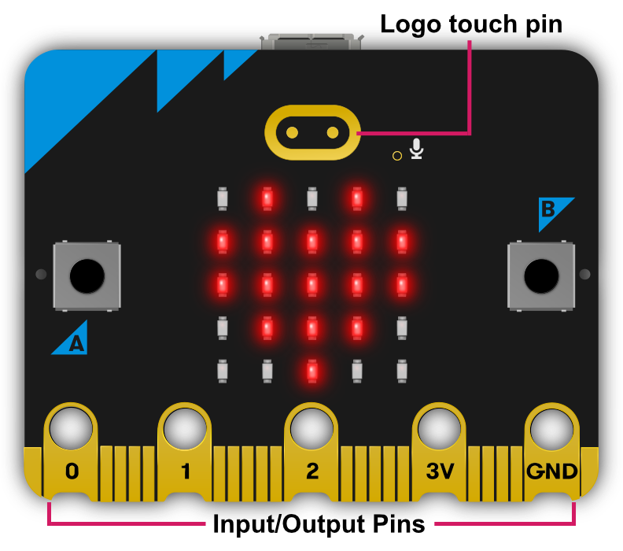
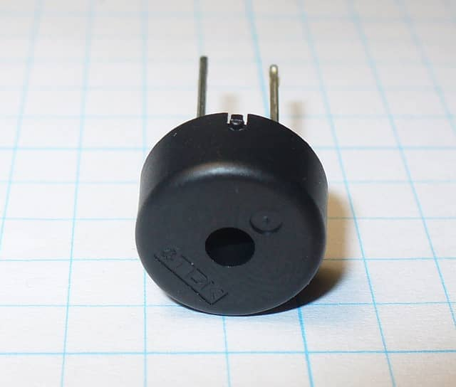

Input/Output Pins
-----------------

There are strips of metal along the bottom edge of the BBC micro:bit that make
it look as if the device has teeth. These are the input/output pins (or I/O pins
for short).

Some of the pins are bigger than others so it's possible to attach crocodile
clips to them. These are the ones labelled 0, 1, 2, 3V and GND (computers
always start counting from zero). If you attach an edge connector board to the
device it's possible to plug in wires connected to the other (smaller) pins.

In MicroPython, each pin on the BBC micro:bit is represented by an *object*
called ``pinN``, where ``N`` is the number pf the pin.

For example, to use the pin labelled 0 (zero), you can use the object called
``pin0`` in your script.

These objects have various *methods* associated with them depending upon what
the specific pin is capable of eg. read, write or touch.

Ticklish Python
+++++++++++++++

The simplest example of input via the pins is a check to see if they are
touched. So, you can tickle your micro:bit to make it laugh like this::

    from microbit import *

    while True:
        if pin0.is_touched():
            display.show(Image.HAPPY)
        else:
            display.show(Image.SAD)

With one hand, hold your micro:bit by the GND pin. Then, with your other hand,
touch (or tickle) the 0 (zero) pin. You should see the display change from
grumpy to happy!

This is a form of very basic input measurement. However, the fun really starts
when you plug in circuits and other devices via the pins.

Bleeps and Bloops
+++++++++++++++++

The simplest thing we can attach to the micro:bit is a Piezo buzzer. There are
two types of piezo buzzers. The simplest type to use are called active buzzers.
Active buzzers contain an oscillator that produces a tone at a predetermined
pitch when a current is passed through them.  Passive buzzers require an 
oscillating current to be passed through them to produce a tone at the frequency
of the oscillation.  In short, active buzzers are simple to use but produce only
one tone, while passive buzzers are slightly more complicated to use but can 
produce a variety of tones.

We're going to use an active piezo buzzer for output. To attach one to your BBC 
micro:bit you should attach crocodile clips to pin 0 and GND (as shown below).

.. image:: pin0-gnd.png
    :width: 250px
    :align: center
    :alt: piezo connected to pin0 and GND

The wire from pin 0 should be attached to the positive connector on the buzzer
and the wire from GND to the negative connector.

The following program will cause the buzzer to make a sound::

    from microbit import *

    pin0.write_digital(1)

This is fun for about 5 seconds and then you'll want to make the horrible
squeaking stop. Let's improve our example and make the device bleep::

    from microbit import *

    while True:
        pin0.write_digital(1)
        sleep(20)
        pin0.write_digital(0)
        sleep(480)

Can you work out how this script works? Remember that ``1`` is "on" and ``0``
is "off" in the digital world.

The device is put into an infinite loop and immediately switches pin 0 on. This
causes the buzzer to emit a beep. While the buzzer is beeping, the device
sleeps for twenty milliseconds and then switches pin 0 off. This gives the
effect of a short bleep. Finally, the device sleeps for 480 milliseconds before
looping back and starting all over again. This means you'll get two bleeps per
second (one every 500 milliseconds).

We've made a very simple metronome!

.. footer:: The image of the pizeo buzzer is CC BY-NC-SA 3.0 from https://www.flickr.com/photos/tronixstuff/4821350094
