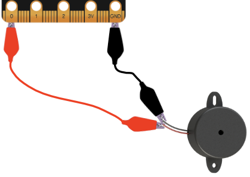

Movement
--------

Your BBC micro:bit comes with an accelerometer. It measures movement along
three axes:

* X - tilting from left to right.
* Y - tilting forwards and backwards.
* Z - moving up and down.

There is a method for each axis that returns a positive or negative number
indicating a measurement in milli-g's. When the reading is 0 you are "level"
along that particular axis.

For example, here's a very simple spirit-level that uses ``get_x`` to measure
how level the device is along the X axis::

    from microbit import *

    while True:
        reading = accelerometer.get_x()
        if reading > 20:
            display.show("R")
        elif reading < -20:
            display.show("L")
        else:
            display.show("-")

If you hold the device flat it should display ``-``; however, rotate it left or
right and it'll show ``L`` and ``R`` respectively.

We want the device to constantly react to change, so we use an
infinite ``while`` loop. The first thing to happen *within the body of the
loop* is a measurement along the X axis which is called ``reading``. Because
the accelerometer is *so* sensitive I've made level +/-20 in range. It's why
the ``if`` and ``elif`` conditionals check for ``> 20`` and ``< -20``. The
``else`` statement means that if the ``reading`` is between -20 and 20 then
we consider it level. For each of these conditions we use the display to show
the appropriate character.

There is also a ``get_y`` method for the Y axis and a ``get_z`` method for the
Z axis.

If you've ever wondered how a mobile phone knows which up to show the images on
its screen, it's because it uses an accelerometer in exactly the same way as
the program above. Game controllers also contain accelerometers to help you
steer and move around in games.

Musical Mayhem
++++++++++++++

One of the most wonderful aspects of MicroPython on the BBC micro:bit is how it
lets you easily link different capabilities of the device together. For
example, let's turn it into a musical instrument (of sorts).

Connect a speaker as you did in the music tutorial. Use crocodile clips to
attach pin 0 and GND to the positive and negative inputs on the speaker - it
doesn't matter which way round they are connected to the speaker.

What happens if we take the readings from the accelerometer and play them as
pitches? Let's find out::

    from microbit import *
    import music

    while True:
        music.pitch(accelerometer.get_y(), 10)

The key line is at the end and remarkably simple. We *nest* the reading from
the Y axis as the frequency to feed into the ``music.pitch`` method. We only
let it play for 10 milliseconds because we want the tone to change quickly as
the device is tipped. Because the device is in an infinite ``while`` loop it
is constantly reacting to changes in the Y axis measurement.

That's it!

Tip the device forwards and backwards. If the reading along the Y axis is
positive it'll change the pitch of the tone played by the micro:bit.

Imagine a whole symphony orchestra of these devices. Can you play a tune? How
would you improve the program to make the micro:bit sound more musical?
