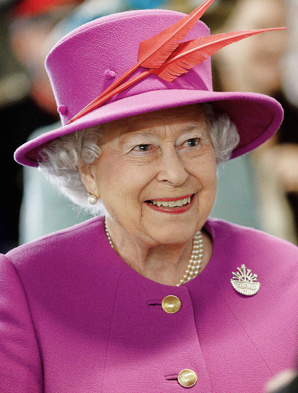

Network
-------

It is possible to connect devices together to send and receive
messages to and from each other. This is called a network. A network of
interconnected networks is called an internet. The Internet is an internet
of all the internets.

Networking is hard and this is reflected in the program described below.
However, the beautiful thing about this project is it contains all the common
aspects of network programming you need to know about. It's also remarkably
simple and fun.

But first, let's set the scene...

Connection
++++++++++

Imagine a network as a series of layers. At the very bottom is the most
fundamental aspect of communication: there needs to be some sort of way for
a signal to get from one device to the other. Sometimes this is done via a
radio connection, but in this example we're simply going to use two wires.

.. image:: network.png

It is upon this foundation that we can build all the other layers in the
*network stack*.

As the diagram shows, blue and red micro:bits are connected via crocodile
leads. Both use pin 1 for output and pin 2 for input. The output from one
device is connected to the input on the other. It's a bit like knowing which
way round to hold a telephone handset - one end has a microphone (the input)
and the other a speaker (the output). The recording of your voice via your
microphone is played out of the other person's speaker. If you hold the
phone the wrong way up, you'll get strange results!

It's exactly the same in this instance: you must connect the wires properly!

Signal
++++++

The next layer in the *network stack* is the signal. Often this will depend
upon the characteristics of the connection. In our example it's simply
digital on and off signals sent down the wires via the IO pins.

If you remember, it's possible to use the IO pins like this::

    pin1.write_digital(1)  # switch the signal on
    pin1.write_digital(0)  # switch the signal off
    input = pin2.read_digital()  # read the value of the signal (either 1 or 0)

The next step involves describing how to use and handle a signal. For that we
need a...

Protocol
++++++++

If you ever meet the Queen there are expectations about how you ought to
behave. For example, when she arrives you may bow or curtsey, if she offers her
hand politely shake it, refer to her as "your majesty" and thereafter as
"ma'am" and so on. This set of rules is called the royal protocol. A protocol
explains how to behave given a specific situation (such as meeting the
Queen). A protocol is pre-defined to ensure everyone understands what's going
on before a given situation arises.

It is for this reason that we define and use protocols for communicating
messages via a computer network. Computers need to agree before hand how to
send and receive messages. Perhaps the best known protocol is the
hypertext transfer protocol (HTTP) used by the world wide web.

Another famous protocol for sending messages (that pre-dates computers) is
Morse code. It defines how to send character-based messages via on/off signals
of long or short durations. Often such signals are played as bleeps. Long
durations are called dashes (``-``) whereas short durations are dots (``.``).
By combining dashes and dots Morse defines a way to send characters. For
example, here's how the standard Morse alphabet is defined::

    .-    A     .---  J     ...   S     .----  1      ----.  9
    -...  B     -.-   K     -     T     ..---  2      -----  0
    -.-.  C     .-..  L     ..-   U     ...--  3
    -..   D     --    M     ...-  V     ....-  4
    .     E     -.    N     .--   W     .....  5
    ..-.  F     ---   O     -..-  X     -....  6
    --.   G     .--.  P     -.--  Y     --...  7
    ....  H     --.-  Q     --..  Z     ---..  8
    ..    I     .-.   R

Given the chart above, to send the character "H" the signal is switched on four
times for a short duration, indicating four dots (``....``). For the letter
"L" the signal is also switched on four times, but the second signal has a
longer duration (``.-..``).

Obviously, the timing of the signal is important: we need to tell a dot from a
dash. That's another point of a protocol, to agree such things so everyone's
implementation of the protocol will work with everyone elses. In this instance
we'll just say that:

* A signal with a duration less than 250 milliseconds is a dot.
* A signal with a duration from 250 milliseconds to less than 500 milliseconds is a dash.
* Any other duration of signal is ignored.
* A pause / gap in the signal of greater than 500 milliseconds indicates the end of a character.

In this way, the sending of a letter "H" is defined as four "on" signals that
last no longer than 250 milliseconds each, followed by a pause of greater than
500 milliseconds (indicating the end of the character).

Message
+++++++

We're finally at a stage where we can build a message - a message that actually
means something to us humans. This is the top-most layer of our *network
stack*.

Using the protocol defined above I can send the following sequence of signals
down the physical wire to the other micro:bit::

    ...././.-../.-../---/.--/---/.-./.-../-..

Can you work out what it says?

Application
+++++++++++

It's all very well having a network stack, but you also need a way to
interact with it - some form of application to send and receive messages.
While HTTP is interesting *most* people don't know about it and let their
web-browser handle it - the underlying *network stack* of the world wide web
is hidden (as it should be).

So, what sort of application should we write for the BBC micro:bit? How should
it work, from the user's point of view?

Obviously, to send a message you should be able to input dots and dashes (we
can use button A for that). If we want to see the message we sent or just
received we should be able to trigger it to scroll across the display (we can
use button B for that). Finally, this being Morse code, if a speaker is
attached, we should be able to play the beeps as a form of aural feedback while
the user is entering their message.

The End Result
++++++++++++++

Here's the program, in all its glory and annotated with plenty of comments so
you can see what's going on::

    from microbit import *
    import music

    # A lookup table of morse codes and associated characters.
    MORSE_CODE_LOOKUP = {
        ".-": "A",
        "-...": "B",
        "-.-.": "C",
        "-..": "D",
        ".": "E",
        "..-.": "F",
        "--.": "G",
        "....": "H",
        "..": "I",
        ".---": "J",
        "-.-": "K",
        ".-..": "L",
        "--": "M",
        "-.": "N",
        "---": "O",
        ".--.": "P",
        "--.-": "Q",
        ".-.": "R",
        "...": "S",
        "-": "T",
        "..-": "U",
        "...-": "V",
        ".--": "W",
        "-..-": "X",
        "-.--": "Y",
        "--..": "Z",
        ".----": "1",
        "..---": "2",
        "...--": "3",
        "....-": "4",
        ".....": "5",
        "-....": "6",
        "--...": "7",
        "---..": "8",
        "----.": "9",
        "-----": "0"
    }

    def decode(buffer):
        # Attempts to get the buffer of Morse code data from the lookup table. If
        # it's not there, just return a full stop.
        return MORSE_CODE_LOOKUP.get(buffer, '.')

    # How to display a single dot.
    DOT = Image("00000:"
                "00000:"
                "00900:"
                "00000:"
                "00000:")

    # How to display a single dash.
    DASH = Image("00000:"
                 "00000:"
                 "09990:"
                 "00000:"
                 "00000:")

    # To create a DOT you need to hold the button for less than 250ms.
    DOT_THRESHOLD = 250
    # To create a DASH you need to hold the button for less than 500ms.
    DASH_THRESHOLD = 500

    # Holds the incoming Morse signals.
    buffer = ''
    # Holds the translated Morse as characters.
    message = ''
    # The time from which the device has been waiting for the next keypress.
    started_to_wait = running_time()

    # Put the device in a loop to wait for and react to key presses.
    while True:
        # Work out how long the device has been waiting for a keypress.
        waiting = running_time() - started_to_wait
        # Reset the timestamp for the key_down_time.
        key_down_time = None
        # If button_a is held down, then...
        while button_a.is_pressed():
            # Play a beep - this is Morse code y'know ;-)
            music.pitch(880, 10)
            # Set pin1 (output) to "on"
            pin1.write_digital(1)
            # ...and if there's not a key_down_time then set it to now!
            if not key_down_time:
                key_down_time = running_time()
        # Alternatively, if pin2 (input) is getting a signal, pretend it's a
        # button_a key press...
        while pin2.read_digital():
            if not key_down_time:
                key_down_time = running_time()
        # Get the current time and call it key_up_time.
        key_up_time = running_time()
        # Set pin1 (output) to "off"
        pin1.write_digital(0)
        # If there's a key_down_time (created when button_a was first pressed
        # down).
        if key_down_time:
            # ... then work out for how long it was pressed.
            duration = key_up_time - key_down_time
            # If the duration is less than the max length for a "dot" press...
            if duration < DOT_THRESHOLD:
                # ... then add a dot to the buffer containing incoming Morse codes
                # and display a dot on the display.
                buffer += '.'
                display.show(DOT)
            # Else, if the duration is less than the max length for a "dash"
            # press... (but longer than that for a DOT ~ handled above)
            elif duration < DASH_THRESHOLD:
                # ... then add a dash to the buffer and display a dash.
                buffer += '-'
                display.show(DASH)
            # Otherwise, any other sort of keypress duration is ignored (this isn't
            # needed, but added for "understandability").
            else:
                pass
            # The button press has been handled, so reset the time from which the
            # device is starting to wait for a  button press.
            started_to_wait = running_time()
        # Otherwise, there hasn't been a button_a press during this cycle of the
        # loop, so check there's not been a pause to indicate an end of the
        # incoming Morse code character. The pause must be longer than a DASH
        # code's duration.
        elif len(buffer) > 0 and waiting > DASH_THRESHOLD:
            # There is a buffer and it's reached the end of a code so...
            # Decode the incoming buffer.
            character = decode(buffer)
            # Reset the buffer to empty.
            buffer = ''
            # Show the decoded character.
            display.show(character)
            # Add the character to the message.
            message += character
        # Finally, if button_b was pressed while all the above was going on...
        if button_b.was_pressed():
            # ... display the message,
            display.scroll(message)
            # then reset it to empty (ready for a new message).
            message = ''

How would you improve it? Can you change the definition of a dot and a dash so
speedy Morse code users can use it? What happens if both devices are sending at
the same time? What might you do to handle this situation?

.. footer:: The image of Queen Elizabeth II is licensed as per the details here: https://commons.wikimedia.org/wiki/File:Queen_Elizabeth_II_March_2015.jpg
