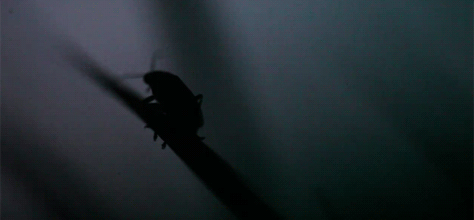

Radio
-----

Interaction at a distance feels like magic.

Magic might be useful if you're an elf, wizard or unicorn, but such things only
exist in stories.

However, there's something much better than magic: physics!

Wireless interaction is all about physics: radio waves (a type of
electromagnetic radiation, similar to visible light) have some sort of property
(such as their amplitude, phase or pulse width) modulated by a transmitter in
such a way that information can be encoded and, thus, broadcast. When radio
waves encounter an electrical conductor (i.e. an aerial), they cause an
alternating current from which the information in the waves can be extracted
and transformed back into its original form.

Layers upon Layers
++++++++++++++++++

If you remember, networks are built in layers.

The most fundamental requirement for a network is some sort of connection that
allows a signal to get from one device to the other. In our networking
tutorial we used wires connected to the I/O pins. Thanks to the radio module we
can do away with wires and use the physics summarised above as the invisible
connection between devices.

The next layer up in the network stack is also different from the example in
the networking tutorial. With the wired example we used digital on and off to
send and read a signal from the pins. With the built-in radio on the
micro:bit the smallest useful part of the signal is a byte.

Bytes
+++++

A byte is a unit of information that (usually) consists of eight bits. A bit is
the smallest possible unit of information since it can only be in two states:
on or off.

Bytes work like a sort of abacus: each position in the byte is like a
column in an abacus - they represent an associated number. In an abacus these
are usually thousands, hundreds, tens and units (in UK parlance). In a byte
they are 128, 64, 32, 16, 8, 4, 2 and 1. As bits (on/off
signals) are sent over the air, they are re-combined into bytes by the
recipient.

Have you spotted the pattern? (Hint: base 2.)

By adding the numbers associated with the positions in a byte that are set to
"on" we can represent numbers between 0 and 255. The image below shows how this
works with five bits and counting from zero to 32:

.. image:: binary_count.gif

If we can agree what each one of the 255 numbers (encoded by a byte) represents ~ such as a character ~ then we can start to send text one character per byte
at a time.

Funnily enough, people have already
`thought of this <https://en.wikipedia.org/wiki/ASCII>`_ ~ using bytes to
encode and decode information is commonplace. This approximately corresponds to
the Morse-code "protocol" layer in the wired networking example.

A really great series of child (and teacher) friendly explanations of "all
things bytes" can be found at the
`CS unplugged <http://csunplugged.org/binary-numbers/>`_ website.

Addressing
++++++++++

The problem with radio is that you can't transmit directly to one person.
Anyone with an appropriate aerial can receive the messages you transmit. As a
result it's important to be able to differentiate who should be receiving
broadcasts.

The way the radio built into the micro:bit solves this problem is quite simple:

* It's possible to tune the radio to different channels (numbered 0-100). This works in exactly the same way as kids' walkie-talkie radios: everyone tunes into the same channel and everyone hears what everyone else broadcasts via that channel. As with walkie-talkies, if you use adjacent channels there is a slight possibility of interference.

* The radio module allows you to specify two pieces of information: an address and a group. The address is like a postal address whereas a group is like a specific recipient at the address. The important thing is the radio will filter out messages that it receives that do not match *your* address and group. As a result, it's important to pre-arrange the address and group your application is going to use.

Of course, the micro:bit is still receiving broadcast messages for other
address/group combinations. The important thing is you don't need to worry
about filtering those out. Nevertheless, if someone were clever enough, they
could just read *all the wireless network traffic* no matter what the target
address/group was supposed to be. In this case, it's *essential* to use
encrypted means of communication so only the desired recipient can actually
read the message that was broadcast. Cryptography is a fascinating subject but,
unfortunately, beyond the scope of this tutorial.

Fireflies
+++++++++

This is a firefly:

It's a sort of bug that uses bioluminescence to signal (without wires) to its
friends. Here's what they look like when they signal to each other:

.. image:: fireflies.gif

The BBC have `rather a beautiful video <http://www.bbc.com/earth/story/20160224-worlds-largest-gathering-of-synchronised-fireflies>`_ of fireflies available online.

We're going to use the radio module to create something akin to a swarm of
fireflies signalling to each other.

First ``import radio`` to make the functions available to your Python program.
Then call the ``radio.on()`` function to turn the radio on. Since
the radio draws power and takes up memory we've made it so *you* decide
when it is enabled (there is, of course a ``radio.off()`` function).

At this point the radio module is configured to sensible defaults that make
it compatible with other platforms that may target the BBC micro:bit. It is
possible to control many of the features discussed above (such as channel and
addressing) as well as the amount of power used to broadcast messages and the
amount of RAM the incoming message queue will take up. The API documentation
contains all the information you need to configure the radio to your needs.

Assuming we're happy with the defaults, the simplest way to send a message is
like this::

    radio.send("a message")

The example uses the ``send`` function to simply broadcast the string
"a message". To receive a message is even easier::

    new_message = radio.receive()

As messages are received they are put on a message queue. The ``receive``
function returns the oldest message from the queue as a string, making space
for a new incoming message. If the message queue fills up, then new incoming
messages are ignored.

That's really all there is to it! (Although the radio module is also powerful
enough that you can send any arbitrary type of data, not just strings. See the
API documentation for how this works.)

Armed with this knowledge, it's simple to make micro:bit fireflies like this:

.. include:: ../../examples/radio.py
    :code: python

The import stuff happens in the event loop. First, it checks if button A was
pressed and, if it was, uses the radio to send the message "flash". Then it
reads any messages from the message queue with ``radio.receive()``. If there is
a message it sleeps a short, random period of time (to make the display more
interesting) and uses ``display.show()`` to animate a firefly flash. Finally,
to make things a bit exciting, it chooses a random number so that it has a 1 in
10 chance of re-broadcasting the "flash" message to anyone else (this is how
it's possible to sustain the firefly display among several devices). If it
decides to re-broadcast then it waits for half a second (so the display from
the initial flash message has chance to die down) before sending
the "flash" signal again. Because this code is enclosed within a ``while True``
block, it loops back to the beginning of the event loop and repeats this
process forever.

The end result (using a group of micro:bits) should look something like this:

.. footer:: The image of binary counting is released under the licensing details listed here: https://en.wikipedia.org/wiki/File:Binary_counter.gif
